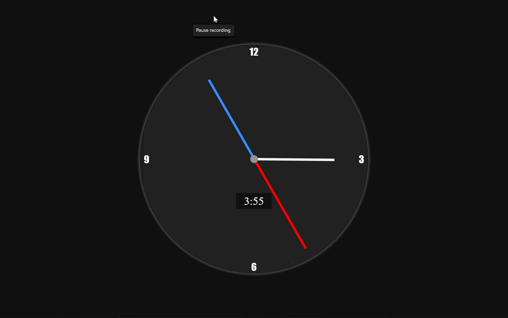

# Analog Clock

A real-time analog clock built with vanilla JavaScript.

## Features

- Real-time clock display
- Digital clock display
- Pure CSS styling

## Files

- `index.html` - Clock markup
- `script.js` - Clock hand rotation logic
- `style.css` - Clock styling and animations

## Thanks

Thanks for checking out this project!

